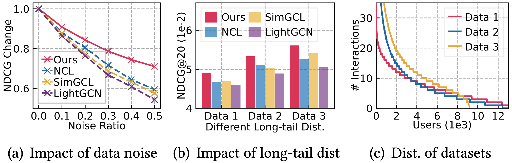
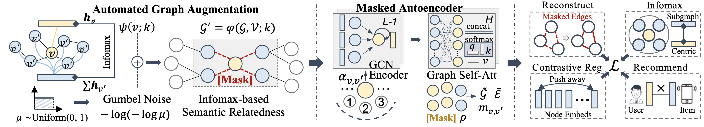

# Automated Self-Supervised Learning for Recommendation

This repository contains pyTorch implementation for AutoCF model proposed in the following paper:

><a href='github.com/akaxlh'>Lianghao Xia</a>, Chao Huang, Chunzhen Huang, Kangyi Lin, Tao Yu and Ben Kao. <i>Automated Self-Supervised Learning for Recommendation</i>. In WWW'23, Austin, US, April 30 - May 4, 2023.

## Introduction
To improve the representation quality over limited labeled data, contrastive learning has attracted attention in recommendation and benefited graph-based CF model recently. However, the success of most contrastive methods heavily relies on manually generating effective contrastive views for heuristic-based data augmentation. This does not generalize across different datasets and downstream recommendation tasks, which is difficult to be adaptive for data augmentation and robust to noise perturbation. As shown in the figure below, state-of-the-art SSL methods (e.g. NCL, SimGCL) present severe performance drop in comparison to our AutoCF, facing high-ratio noises and long-tail data distributions.



To fill the crucial gap, this work proposes a unified <u>Auto</u>mated <u>C</u>ollaborative <u>Filtering</u> (AutoCF) to automatically perform data augmentation for recommendation. Specifically, we focus on the generative self-supervised learning framework with a learnable augmentation paradigm that benefits the automated distillation of important self-supervised signals. To enhance the representation discrimination ability, our masked graph autoencoder is designed to aggregate global information during the augmentation via reconstructing the masked subgraph structures. The overall framework of AutoCF is given below.



## Citation
```
@inproceedings{autocf2023,
  author    = {Xia, Lianghao and
               Huang, Chao and
               Huang, Chunzhen and
               Lin, Kangyi and
               Yu, Tao and
               Kao, Ben},
  title     = {Automated Self-Supervised Learning for Recommendation},
  booktitle = {The Web Conference (WWW)},
  year      = {2023},
}
```

## Environment
The implementation for AutoCF is under the following development environment:
* python=3.10.4
* torch=1.11.0
* numpy=1.22.3
* scipy=1.7.3

## Datasets
We utilize three datasets for evaluating SimRec: <i>Yelp, Gowalla, </i>and <i>Amazon</i>. Note that compared to the data used in our previous works, in this work we utilize a more sparse version of the three datasets, to increase the difficulty of recommendation task. Our evaluation follows the common implicit feedback paradigm. The datasets are divided into training set, validation set and test set by 70:5:25.
| Dataset | \# Users | \# Items | \# Interactions | Interaction Density |
|:-------:|:--------:|:--------:|:---------------:|:-------:|
|Yelp   |$42,712$|$26,822$|$182,357$|$1.6\times 10^{-4}$|
|Gowalla|$25,557$|$19,747$|$294,983$|$5.9\times 10^{-4}$|
|Amazon |$76,469$|$83,761$|$966,680$|$1.5\times 10^{-4}$|

## Usage
Please unzip the datasets first. Also you need to create the `History/` and the `Models/` directories. Switch the working directory to `methods/AutoCF/`. The command lines to train AutoCF using our pre-trained teachers on thre three datasets are as below. The un-specified hyperparameters in the commands are set as default.

* Yelp
```
python Main.py --data yelp --reg 1e-4 --seed 500
```
* Gowalla
```
python Main.py --data gowalla --reg 1e-6
```
* Amazon
```
python Main.py --data amazon --reg 1e-5 --seed 500
```

### Important Arguments
* `reg`: It is the weight for weight-decay regularization. We tune this hyperparameter from the set `{1e-3, 1e-4, 1e-5, 1e-6, 1e-7, 1e-8}`.
* `seedNum`: This hyperparameter denotes the number of seeds in subgraph masking. Recommended values are `{200, 500}`.